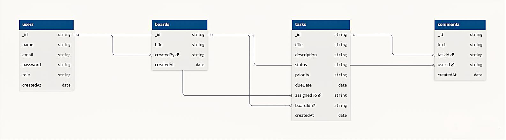

# TaskMatrix – Project Management Tool

## 📌 Project Description
TaskMatrix is a modern project management web application designed for software teams to efficiently organize, track, and collaborate on tasks. Inspired by tools like Jira and Asana, it provides Kanban boards, task assignments, and real-time updates to improve productivity.

---

## 🎯 Project Goal
To design and develop a scalable project management tool that enables teams to manage tasks visually, collaborate in real-time, and track progress effectively.

---

## 🧭 Track
**Fullstack Development**

---

## 🛠️ Tech Stack

### Frontend:
- Next.js
- Tailwind CSS
- Axios
- Socket.io-client

### Backend:
- Node.js
- Express.js
- Socket.io

### Database:
- MongoDB (Mongoose)

### Other Tools:
- JWT Authentication
- Cloudinary (optional)
- Git & GitHub

---

## 🚀 Core Features

### 🔐 Authentication
- User signup & login
- JWT-based authentication
- Protected routes

### 📋 Kanban Board
- Create multiple boards
- Columns: To Do, In Progress, Done
- Drag-and-drop tasks

### ✅ Task Management
- Create, edit, delete tasks
- Assign tasks to users
- Add descriptions, due dates, priorities

### 👥 Team Collaboration
- Add/remove members
- Role-based access (Admin/Member)

### 🔔 Real-Time Updates
- Live task updates using Socket.io
- Activity feed

### 📅 Deadlines
- Due dates with overdue indicators

### 🏷️ Tags & Filters
- Priority labels
- Filter by user, status, priority

---

## 🎨 UI Wireframes (Figma)

View the design here:  
👉 https://your-figma-link-here

---

## 🧠 Architecture Diagram (ERD)

---

## 🧱 Database Design

### Users
- _id
- name
- email
- password
- role
- createdAt

### Boards
- _id
- title
- createdBy
- members
- createdAt

### Tasks
- _id
- title
- description
- status
- priority
- dueDate
- assignedTo
- boardId
- createdAt

### Comments
- _id
- text
- taskId
- userId
- createdAt

---

## 🔄 Future Enhancements
- Notifications (email/push)
- File attachments
- Task comments UI
- Dark mode
- Mobile responsiveness

---

## 📅 Development Plan

- Week 1: PRD & Design
- Week 2: Backend APIs
- Week 3: Frontend UI
- Week 4: Integration & Real-time features
- Week 5: Testing & Deployment

---

## 📌 Conclusion
TaskMatrix replicates core functionality of professional project management tools while maintaining simplicity and scalability. This project demonstrates fullstack development skills including real-time systems, authentication, and structured architecture.

---
